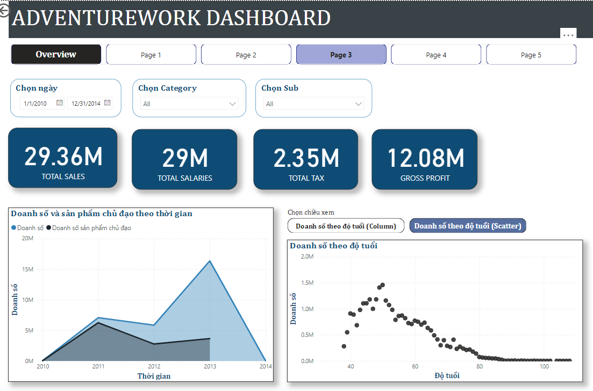
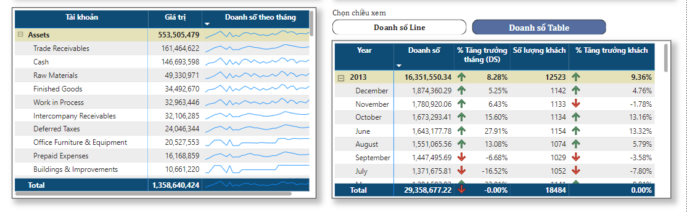
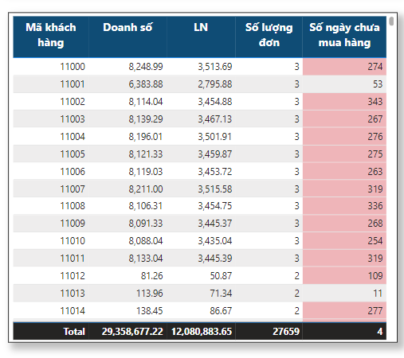
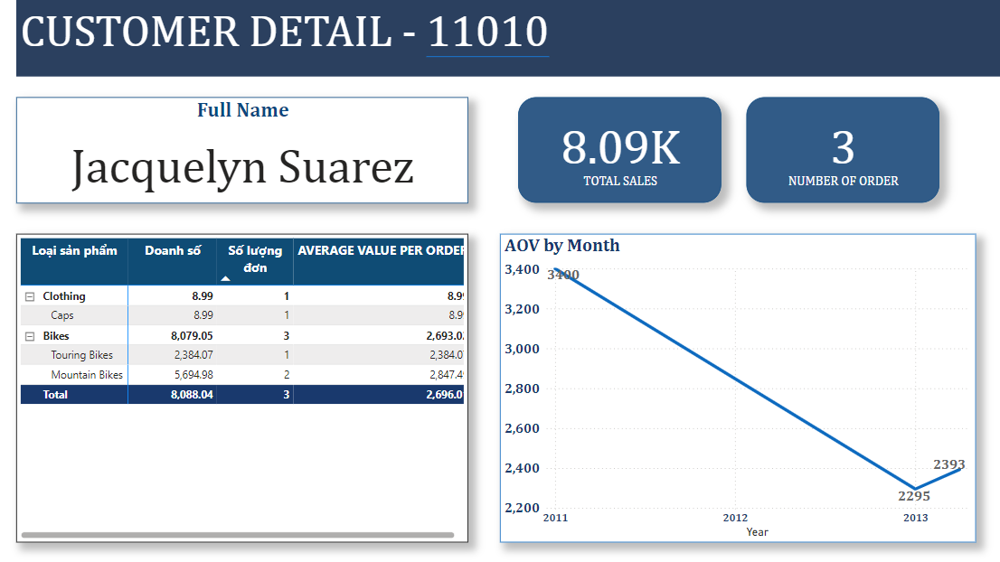
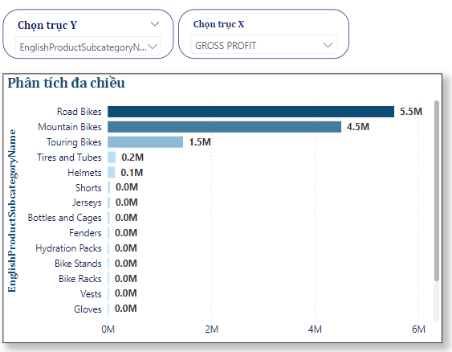

# AdventureWorks Sales Analysis Report

This repository contains a Power BI report analyzing the AdventureWorks dataset, focusing on sales performance, customer demographics, and product insights. The report provides a comprehensive overview of key metrics to support business decisions.

## 📊 Project Overview

The AdventureWorks Sales Analysis Report explores multiple facets of business performance for AdventureWorks, a sample retail company specializing in bicycles and accessories. The analysis focuses on:
- **Sales Performance**: Revenue trends, top-selling products, and regional sales distribution.

- **Customer Insights**: purchasing patterns.
- **Product Analysis**: Product categories, inventory levels, and profitability.

## 📈 Key Insights

- **Sales Trends**: Analysis of monthly and yearly sales trends to identify peak seasons and high-demand products.
- 
  
  
- **Customer Segmentation**: Breakdown of customer demographics (age, location, etc.) to understand target audiences.
- 
  
  
  **Customer Detail**
  
  
  
- **Product Performance**: Insights into the best-selling product categories and stock levels to optimize inventory.
- 
 

##  Features of the Report

- **Interactive Visuals**: Custom charts and dashboards for an interactive exploration of data.
- **Drill-Downs**: Clickable categories to drill down into specific details such as product or regional performance.
- **Drill-through**: Customer Details from Overview Page
- 
 

- **Filters**: Ability to filter data by date, region, and product type for targeted analysis.

##  Technologies Used

- **Power BI Desktop** for data visualization
- **SQL** for data extraction and transformation
- **AdventureWorks DW Database** as the data source

## Project Files

- **AdventureWorks_Sales_Analysis.pbix**: The main Power BI report file.
- **README.md**: Project documentation.
- **Screenshots**: Sample screenshots of the report visuals (optional).

## How to Use

1. Clone or download this repository.
2. Open the `.pbix` file with Power BI Desktop.
3. Explore the report's visuals and interact with filters and drill-downs.

Thank you for checking out this project! Happy analyzing!

